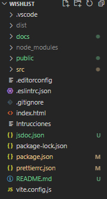
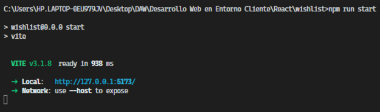
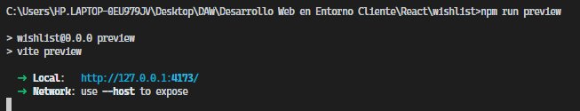
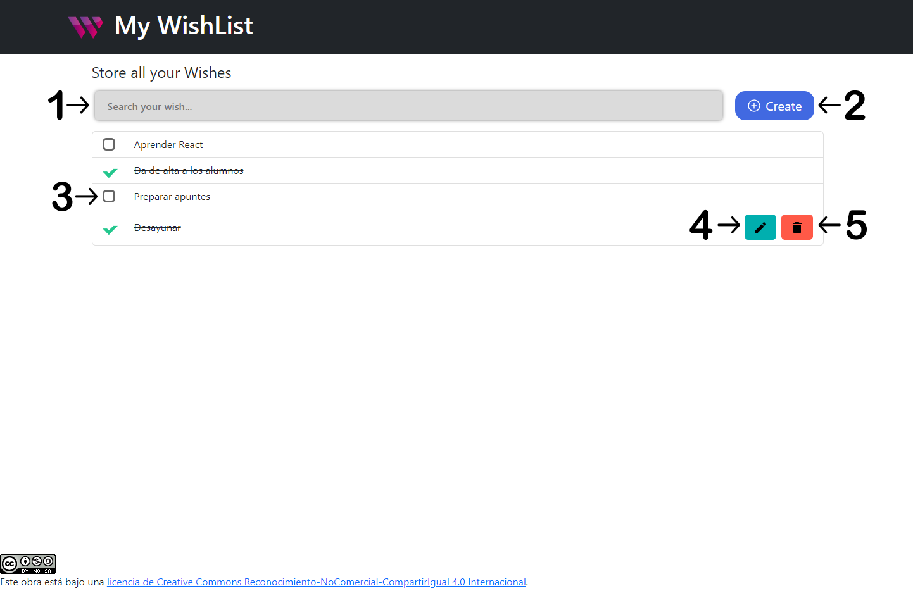
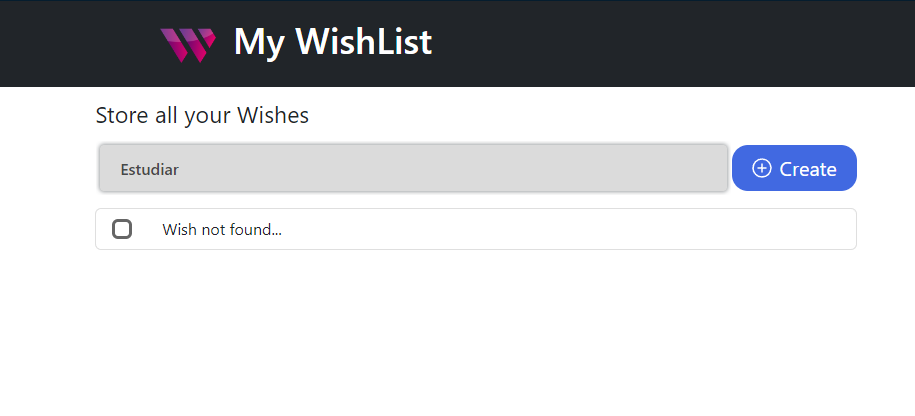
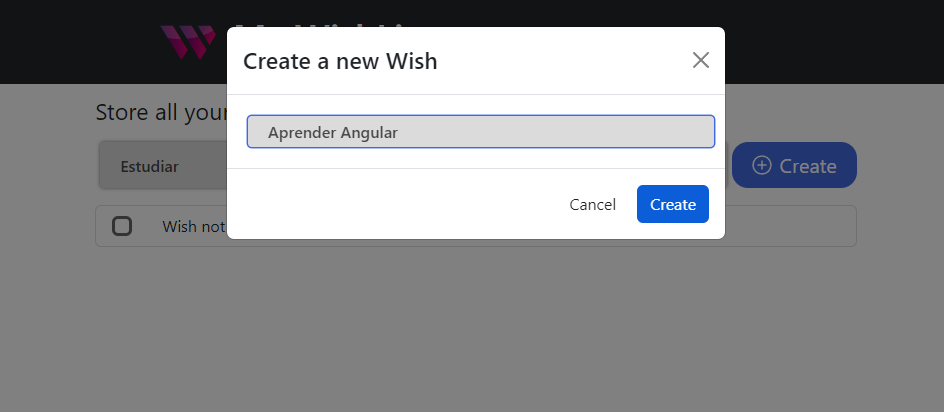
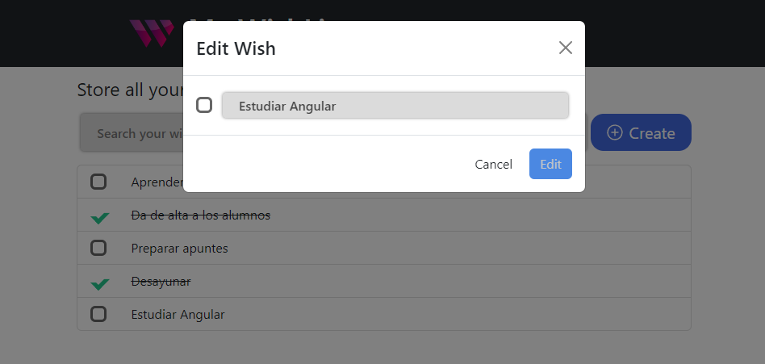

# Desarrolo Web en Entorno Cliente 
## WishList


   
[Juan Francisco Aguilar Sanchez](https://github.com/JuanFrancisco21)

24 de noviembre de 2022                                      I.E.S Francisco de los Rios
 
<br>

## Índice 
1. [Descripción del proyecto](#id1)
2. [Características](#id2)
3. [Instalación](#id3)
4. [Manual de uso](#id4)
5. [Licencia](#id5)

 
<br>

<!----------------------------- DESCRIPCION DEL PROYECTO -------------------------------->
# Descripcion React Wishlist <a name="id1"></a>

Este es un proyecto desarrollado en la asignatura de Desarrolo Web en Entorno Cliente, impartida por Rafael Morales.

Como actividad para su evaluacion se nos ha requerido de la creación de un proyecto con el framework de react. En el cual debemos aplicar los conocimientos adquiridos tanto en dicho framework como en javascript, para la creación de una lista de deseos en la cual poder, modificarlos a nuestro propio antojo.
 
<br>

<!----------------------------- CARACTERISTICAS -------------------------------->
# Características <a name="id2"></a>

En continuación de el proyecto "Wishlist" comenzado en clase se han disesñado las siguientes funcionalidades y requisitos:

- Incluir alguna imagen en la cabecera a modo de logo de la aplicación.
- Mostrar una lista de deseos con un checkbox que permita marcar el deseo como completado. Una vez marcado el deseo debe mostrarse diferente al resto, por ejemplo tachando el texto.
- Permitir añadir deseos nuevos simplemente pulsando la tecla intro en el campo de texto.
- Añadir un botón que también sirva para añadir el texto del nuevo deseo a la lista.
- Almacenar deseos en el almacenamiento local del navegador y recuperarlos automáticamente al abrir la aplicación.
- Eliminar un deseo concreto de la lista.
- Editar un deseo concreto de la lista, mediante la edición en línea del texto, mediante un modal, etc.
- Reordenar los deseos de la lista, arrastrando los deseos, mediante iconos para subir o bajar el deseo, etc.
- Buscar deseos, la lista se filtrará mostrando sólo los que correspondan con la búsqueda. Incluir algún proceso para eliminar esa búsqueda y que vuelvan a aparecer todos los deseos.
 
<br>

<!----------------------------- INSTALACION -------------------------------->
# Instalación <a name="id3"></a>
La instalación de un proyecto de react es de las mas básicas de realizar, tanto es así que solo se requiere de un comando, para empezar a utilizarlo.

- Este seria install para añadir todos las librerias necesarias y nombradas en el archivo package.json

```
npm install
```
-  Una vez ejecutado este comando notaremos la aparición de la carpeta node_modules, carpeta la cual aloja todas las librerias usadas. 

 <br>

- Para generar las diferentes carpetas mostradas en las imagen siguiente, una de ellas 'dist' esta expliacado en el apartado de Manual de Uso y para la creación de la documentación situada en la carpeta docs, seria con el siguiente comando

```
npm run docs
```

 <br>



 <br>

<!----------------------------- MANUAL DE USO -------------------------------->
# Manual de uso <a name="id4"></a>

Muy bien ahora ya que ya estan todos los paketes de la carpeta node-modules instalados ejecutaremos el proyecto. Con el siguiente comando: 

- Con un comando ya predefinido en el package.json lo iniciaremos.

```
npm run start
```


- En caso de que queramos usar la build creada utilizaremos el comando build seguidamente del comando preview.

```
npm run build
npm run preview
```
- El primer comando nos generará una carpeta llamada dist donde estara todo el proyecto compilado y listo para el despliege del mismo en cualquier plataforma. Finalizando con el comando preview el cual ejecuta dicha carpeta para comprobar de ultima mano su correcto funcionamiento.



 <br>

### Una vez que tenemos desplegado nuestro proyecto ya sea en local como alojado en un servicio web podremos utilizar las diferentes funciones basicas:

 <br>

1. Barra de busqueda de deseos.
2. Boton para creación de nuevos deseos.
3. Checkbox para marcar tarea como realizada.
4. Boton de editar deseo.
5. Boton para borrar un deseo.

 <br>



 <br>


## 1. Barra de busqueda de deseos.
Introduciendo datos en este input obtendremos un listado con los deseos que coincidan con el texto introducido, salvo en le caso de que se no se encuentre ninguna conincidencia donde se mostrara un texto donde leeremos deseos no encontrados.

 <br>



 <br>

## 2. Boton para creación de nuevos deseos.
Como ya se ha mencionado anteriormente, uno de los requisitos era disponer de un boton para la creación de nuevos deseos, en este caso esta diseñado para abrir una pantalla modal en la cual introduciremos el texto del nuevo deseo a crear y se dispone de dos formas de crearlo, pulsando en el boton de crear o pulsando la tecla 'Enter'.

 <br>



 <br>

## 3. Checkbox para marcar tarea como realizada.
En el caso del marcaje de los deseos realizados se utilizan los checkbox situados a la izquierda del texto. Cuando a uno de ellos lo marcamos como completo cambia el texto y se muestra tachado. Este se activa simplemente pulsando con el raton encima de el.

 <br>

## 4. Boton de editar deseo.
Otro requisito básico de cualquier software del que dispone de un CRUD esta es la forma de editar los diferentes deseos. Para facilitar al usuario su experiencia al igual que el boton de crear, para editar se muestra en una pantalla modal pudiendo ejecutarlo solamente pulsando en el boton de crear o pulsando la tecla 'Enter'.

 <br>



 <br>

## 5. Boton para borrar un deseo.
Como ultima función se dispone de un boton de borrado de deseos, el cual al pulsarlo directamente se borrará diho deseo. Una futura implementación seria la confirmación mediante una alerta para mayor seguridad del borrado de datos sensibles.

 <br>
 <br>

<!----------------------------- LICENCIA -------------------------------->
# Licencia (Reconocimiento-NoComercial-CompartirIgual 4.0 Internacional)<a name="id5" ></a>

## Usted es libre de:

* Compartir - copiar y redistribuir el material en cualquier medio o formato
* Adaptar - remezclar, transformar y construir sobre el material
* El licenciante no puede revocar estas libertades siempre que se respeten los términos de la licencia.

<br>

## Bajo los siguientes términos:

* `Atribución` - Debe dar el crédito apropiado, proporcionar un enlace a la licencia e indicar si se hicieron cambios. Puede hacerlo de cualquier forma razonable, pero no de ninguna manera que sugiera que el licenciante lo respalda a usted o a su uso.             

* `No comercial` - No puede utilizar el material con fines comerciales.

* `CompartirIgual` - Si usted remezcla, transforma o construye sobre el material, debe distribuir sus contribuciones bajo la misma licencia que el original.

* `Sin restricciones adicionales` - No puede aplicar términos legales o medidas tecnológicas que restrinjan legalmente a otros de hacer cualquier cosa que la licencia permita.

<br>


<!----------------------------- AUTOR -------------------------------->
# Author

[Juan Francisco Aguilar Sanchez](https://github.com/JuanFrancisco21)

<br>
<br>

<a rel="license" href="http://creativecommons.org/licenses/by-nc-sa/4.0/"></a><br />Este obra está bajo una <a rel="license" href="http://creativecommons.org/licenses/by-nc-sa/4.0/">licencia de Creative Commons Reconocimiento-NoComercial-CompartirIgual 4.0 Internacional</a>.

<br>