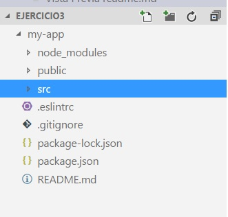
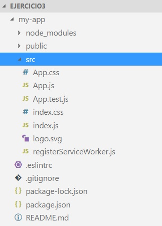

# Mi primer proyecto en React

Muy bien ahora ya que hiciste tu primer componente en React
vamos a empezar un proyecto. 

Para ello debes seguir los siguientes pasos

[Iniciando mi proyecto React](https://reactjs.org/tutorial/tutorial.html)

- Instalamos de manera global create-react-app

```
npm install -g create-react-app
```

- Ahora creamos nuestro proyecto y le ponemos nombre.

```
create-react-app nombre-de-tu-proyecto
```

- Luego entras a la carpeta de tu proyecto

```
cd nombre-de-tu-proyecto
```

- Ahora inicias el proyecto y levantas el servidor

```
npm start
```

## Entendiendo la estructura de carpetas



- **Carpeta Public**

Ahi se encuentra nuestro archivo index.html que es el que se mostrará en el navegador.
En su interior solo tiene un div con el id 'root'

```html
<div id="root"></div>
```


- **Carpeta src**

Empieza con toda la estructura del proyecto
empieza con el archivo `index.js`



Y lo que debes entender es:

- `import` : se usa para importar funciones que han sido exportadas desde un módulo externo.


*Mira el archivo index.js*

```code en el archivo index.js
import App from './App';
```


- `export` : La declaración export es usada para exportar funciones, objetos o tipos de dato primitivos a partir de un archivo (o módulo). 

*Mira el archivo App.js*

```code
export default App;

```

## Archivos de src

- `index.js` : Es el corazón del proyecto, se encuentran importados todos los recursos.

- `index.css` : Es el css general de la aplicación.

- `App.js` : Componente app de react

- `App.css`: Es el css que se va a aplicar al componente App de React.

Recuerda cada componente maneja su propio CSS

